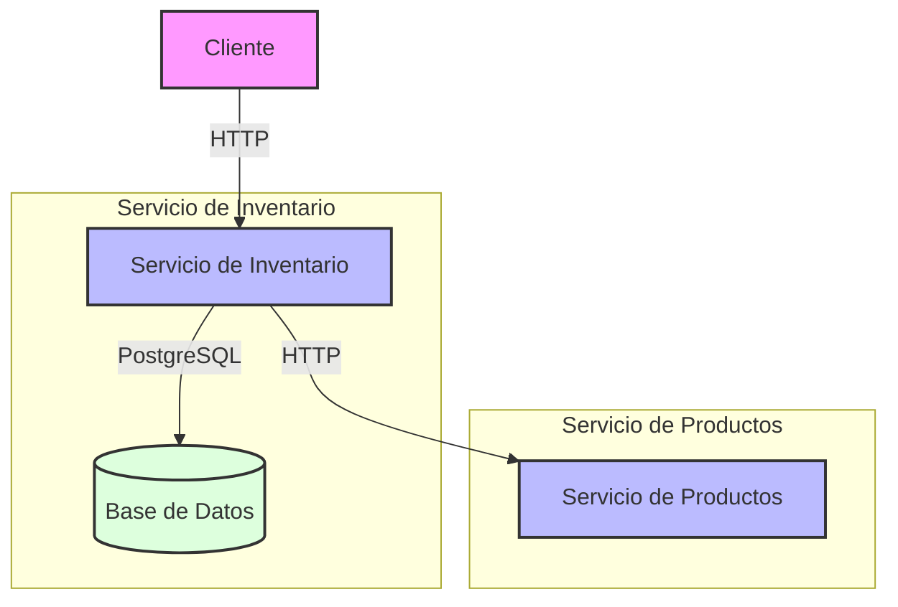

# Microservicio de Inventario

Este proyecto implementa un microservicio para la gestión de inventario de productos. El servicio forma parte de una arquitectura distribuida que se comunica con el servicio de productos mediante peticiones HTTP siguiendo el estándar JSON API.

## Tabla de contenidos

- [Arquitectura](#arquitectura)
- [Tecnologías utilizadas](#tecnologías-utilizadas)
- [Requisitos previos](#requisitos-previos)
- [Instalación y ejecución](#instalación-y-ejecución)
- [Configuración](#configuración)
- [Endpoints de la API](#endpoints-de-la-api)
- [Comunicación entre servicios](#comunicación-entre-servicios)
- [Decisiones técnicas](#decisiones-técnicas)
- [Pruebas](#pruebas)
- [Resolución de problemas](#resolución-de-problemas)

## Arquitectura

El microservicio de inventario es parte de una arquitectura de microservicios que gestiona el catálogo de productos y su inventario. Este servicio específicamente se encarga de:

1. Mantener registro de la cantidad disponible de cada producto
2. Comunicarse con el servicio de productos para obtener información detallada
3. Proporcionar respuestas con formato JSON API estándar
4. Emitir eventos cuando el inventario cambia

### Diagrama de arquitectura



### Flujo de comunicación

1. El cliente hace una petición al servicio de inventario
2. El servicio de inventario consulta su base de datos PostgreSQL
3. Para información adicional del producto, el servicio consulta al servicio de productos
4. La respuesta se formatea según el estándar JSON API y se envía al cliente

## Tecnologías utilizadas

- **Backend**:
  - NestJS (Node.js)
  - TypeScript
  - TypeORM
  - PostgreSQL
  - JSON API

- **Documentación**:
  - Swagger/OpenAPI

- **Contenedores**:
  - Docker
  - Docker Compose

- **Pruebas**:
  - Jest

## Requisitos previos

- Node.js 18+
- PostgreSQL 15+
- Docker y Docker Compose (para despliegue containerizado)

## Instalación y ejecución

### Usando Docker (recomendado)

1. Clonar el repositorio:
```bash
git clone <repository-url>
cd inventory-service
```

2. Crear archivo .env:
```bash
cp .env.example .env
```

3. Iniciar los servicios:
```bash
docker-compose up -d
```

El servicio estará disponible en `http://localhost:3001`
La documentación Swagger estará disponible en `http://localhost:3001/api`

### Instalación local (desarrollo)

1. Instalar dependencias:
```bash
npm install
```

2. Configurar variables de entorno:
```bash
cp .env.example .env
```

3. Iniciar el servicio:
```bash
npm run start:dev
```

## Configuración

### Variables de entorno

```env
# Puerto del servicio
PORT=3001

# Configuración de la base de datos
DB_HOST=localhost
DB_PORT=5432
DB_USERNAME=postgres
DB_PASSWORD=postgres
DB_DATABASE=inventory_db

# URL del servicio de productos
PRODUCTS_SERVICE_URL=http://localhost:3000

# API Key para autenticación
API_KEY=your-api-key

# Modo de prueba (opcional)
TEST_MODE=false
```

## Endpoints de la API

### Obtener inventario por ID de producto

```http
GET /inventory/{productId}
Authorization: Bearer {api-key}
```

Respuesta exitosa:
```json
{
  "data": {
    "id": "1",
    "type": "inventory",
    "attributes": {
      "productId": 1,
      "quantity": 100,
      "createdAt": "2024-02-20T12:00:00Z",
      "updatedAt": "2024-02-20T12:00:00Z"
    },
    "relationships": {
      "product": {
        "data": {
          "id": "1",
          "type": "product"
        }
      }
    }
  },
  "included": [
    {
      "id": "1",
      "type": "product",
      "attributes": {
        "name": "Producto de prueba",
        "description": "Descripción del producto",
        "price": 99.99,
        "createdAt": "2024-02-20T12:00:00Z",
        "updatedAt": "2024-02-20T12:00:00Z"
      }
    }
  ]
}
```

### Actualizar inventario

```http
PATCH /inventory/{productId}
Authorization: Bearer {api-key}
Content-Type: application/json

{
  "data": {
    "type": "inventory",
    "attributes": {
      "quantity": 150
    }
  }
}
```

Respuesta exitosa:
```json
{
  "data": {
    "id": "1",
    "type": "inventory",
    "attributes": {
      "productId": 1,
      "quantity": 150,
      "createdAt": "2024-02-20T12:00:00Z",
      "updatedAt": "2024-02-20T12:30:00Z"
    },
    "relationships": {
      "product": {
        "data": {
          "id": "1",
          "type": "product"
        }
      }
    }
  },
  "included": [
    {
      "id": "1",
      "type": "product",
      "attributes": {
        "name": "Producto de prueba",
        "description": "Descripción del producto",
        "price": 99.99,
        "createdAt": "2024-02-20T12:00:00Z",
        "updatedAt": "2024-02-20T12:00:00Z"
      }
    }
  ]
}
```

## Comunicación entre servicios

La comunicación entre el microservicio de Inventario y el de Productos se realiza mediante peticiones HTTP con las siguientes características:

- **Autenticación**: Mediante API Keys (encabezado `Authorization: Bearer {api-key}`)
- **Formato**: JSON API para solicitudes y respuestas
- **Manejo de errores**: Sistema de reintentos configurable para gestionar fallos de comunicación
- **Eventos**: El microservicio de Inventario emite eventos cuando el inventario cambia

### Ejemplo de flujo:

1. Cliente solicita información de inventario para un producto específico
2. Microservicio de Inventario:
   - Busca el inventario del producto en su base de datos
   - Realiza una petición HTTP al microservicio de Productos para obtener los detalles del producto
   - Combina la información y retorna una respuesta con formato JSON API

## Decisiones técnicas

### Base de datos

Se eligió PostgreSQL por las siguientes razones:
- Soporte transaccional: Necesario para operaciones atómicas en el inventario
- Buen rendimiento: Adecuado para las consultas de inventario
- Integración eficiente con TypeORM y NestJS

### Estándar JSON API

Se implementó este estándar para:
- Proporcionar una experiencia coherente entre los microservicios
- Facilitar las relaciones entre recursos (inventario y productos)
- Estandarizar el formato de errores
- Mejorar la documentación y comprensión de la API

### Logs estructurados

Se implementó un sistema de logs estructurados para:
- Facilitar el diagnóstico de problemas
- Mejorar la observabilidad
- Registrar información importante de manera consistente

### Manejo de excepciones

Se implementaron filtros de excepciones para:
- Estandarizar las respuestas de error
- Seguir el formato JSON API
- Registrar adecuadamente los errores

## Pruebas

### Ejecución de pruebas

```bash
# Pruebas unitarias
npm run test

# Pruebas con cobertura
npm run test:cov
```

### Estrategia de pruebas

El servicio mantiene una cobertura de tests superior al 60%, incluyendo:
- Tests unitarios para servicios y controladores
- Tests de integración para endpoints
- Tests para verificar el formato JSON API de las respuestas
- Tests de casos de error y validación de datos

## Resolución de problemas

### Problemas comunes

1. **Error de conexión a base de datos**
   - Verificar que PostgreSQL esté corriendo
   - Comprobar credenciales en .env
   - Asegurar que el puerto no esté en uso

2. **Error de conexión al servicio de productos**
   - Verificar que el servicio de productos esté corriendo
   - Comprobar URL en .env
   - Revisar logs para detalles específicos

3. **Errores de validación**
   - Asegurar que los datos enviados cumplan con el esquema
   - Verificar tipos de datos correctos
   - Revisar mensajes de error en la respuesta