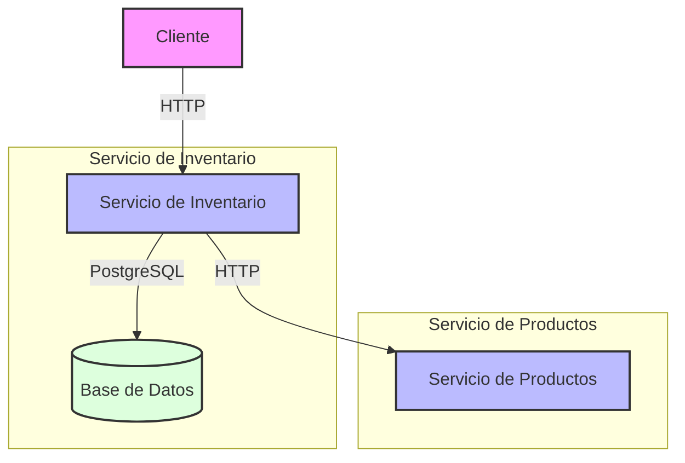

# Servicio de Inventario

Este servicio es parte de una arquitectura de microservicios y se encarga de gestionar el inventario de productos. Se comunica con el servicio de productos a través de una API REST siguiendo el estándar JSON API.

## Características

- Gestión de inventario de productos
- Integración con servicio de productos
- Validación de datos
- Documentación con Swagger
- Manejo de errores estandarizado
- Logging detallado
- Tests unitarios y de integración
- Dockerización completa
- Monitoreo de eventos de inventario

## Arquitectura

### Diagrama de Conexión



### Flujo de Comunicación

1. El cliente hace una petición al servicio de inventario
2. El servicio de inventario consulta su base de datos PostgreSQL
3. Para información adicional del producto, el servicio consulta al servicio de productos
4. La respuesta se formatea según el estándar JSON API y se envía al cliente

## Requisitos

- Node.js 18+
- PostgreSQL 15+
- Docker y Docker Compose (opcional)

## Instalación

### Usando Docker (Recomendado)

1. Clonar el repositorio:
```bash
git clone <repository-url>
cd inventory-service
```

2. Crear archivo .env:
```bash
cp .env.example .env
```

3. Iniciar los servicios:
```bash
docker-compose up -d
```

El servicio estará disponible en `http://localhost:3001`

### Instalación Local

1. Instalar dependencias:
```bash
npm install
```

2. Configurar variables de entorno:
```bash
cp .env.example .env
```

3. Iniciar el servicio:
```bash
npm run start:dev
```

## Configuración

### Variables de Entorno

```env
# Puerto del servicio
PORT=3001

# Configuración de la base de datos
DB_HOST=localhost
DB_PORT=5432
DB_USERNAME=postgres
DB_PASSWORD=postgres
DB_DATABASE=inventory_db

# URL del servicio de productos
PRODUCTS_SERVICE_URL=http://localhost:3000

# API Key para autenticación
API_KEY=your-api-key

# Modo de prueba (opcional)
TEST_MODE=false
```

### Base de Datos

El servicio utiliza PostgreSQL con la siguiente estructura:

```sql
CREATE TABLE inventory (
    id SERIAL PRIMARY KEY,
    product_id INTEGER NOT NULL,
    quantity INTEGER NOT NULL,
    created_at TIMESTAMP DEFAULT CURRENT_TIMESTAMP,
    updated_at TIMESTAMP DEFAULT CURRENT_TIMESTAMP
);
```

## API Endpoints

### Obtener Inventario por ID de Producto

```http
GET /inventory/{productId}
Authorization: Bearer {api-key}
```

Respuesta exitosa:
```json
{
  "data": {
    "id": "1",
    "type": "inventory",
    "attributes": {
      "productId": 1,
      "quantity": 100,
      "createdAt": "2024-02-20T12:00:00Z",
      "updatedAt": "2024-02-20T12:00:00Z"
    },
    "relationships": {
      "product": {
        "data": {
          "id": "1",
          "type": "product"
        }
      }
    }
  },
  "included": [
    {
      "id": "1",
      "type": "product",
      "attributes": {
        "name": "Producto de prueba",
        "description": "Descripción del producto",
        "price": 99.99,
        "createdAt": "2024-02-20T12:00:00Z",
        "updatedAt": "2024-02-20T12:00:00Z"
      }
    }
  ]
}
```

### Actualizar Inventario

```http
PATCH /inventory/{productId}
Authorization: Bearer {api-key}
Content-Type: application/json

{
  "data": {
    "type": "inventory",
    "attributes": {
      "quantity": 150
    }
  }
}
```

Respuesta exitosa:
```json
{
  "data": {
    "id": "1",
    "type": "inventory",
    "attributes": {
      "productId": 1,
      "quantity": 150,
      "createdAt": "2024-02-20T12:00:00Z",
      "updatedAt": "2024-02-20T12:30:00Z"
    },
    "relationships": {
      "product": {
        "data": {
          "id": "1",
          "type": "product"
        }
      }
    }
  },
  "included": [
    {
      "id": "1",
      "type": "product",
      "attributes": {
        "name": "Producto de prueba",
        "description": "Descripción del producto",
        "price": 99.99,
        "createdAt": "2024-02-20T12:00:00Z",
        "updatedAt": "2024-02-20T12:00:00Z"
      }
    }
  ]
}
```

## Documentación API

La documentación completa de la API está disponible en:
```
http://localhost:3001/api
```

## Tests

### Ejecutar Tests

```bash
# Tests unitarios
npm run test

# Tests con cobertura
npm run test:cov
```

### Cobertura de Tests

El servicio mantiene una cobertura de tests superior al 60%, incluyendo:
- Tests unitarios para servicios y controladores
- Tests de integración para endpoints
- Tests de casos de error
- Tests de validación de datos

## Resolución de Problemas

### Problemas Comunes

1. **Error de Conexión a Base de Datos**
   - Verificar que PostgreSQL esté corriendo
   - Comprobar credenciales en .env
   - Asegurar que el puerto no esté en uso

2. **Error de Conexión al Servicio de Productos**
   - Verificar que el servicio de productos esté corriendo
   - Comprobar URL en .env
   - Revisar logs para detalles específicos

3. **Errores de Validación**
   - Asegurar que los datos enviados cumplan con el esquema
   - Verificar tipos de datos correctos
   - Revisar mensajes de error en la respuesta

### Logs

Los logs están disponibles en:
- Docker: `docker-compose logs -f inventory-service`
- Local: `npm run start:dev`